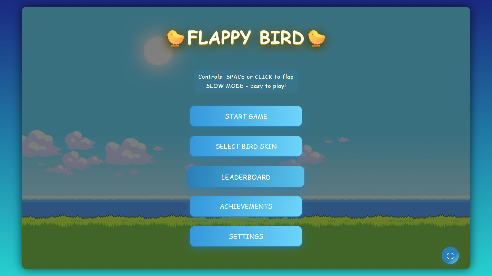
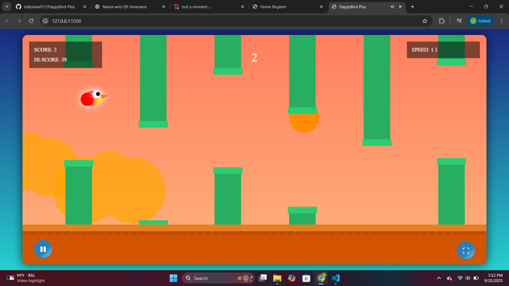

# 🐦 FlappyBird Plus

Versi modifikasi dari game klasik **Flappy Bird**, dibuat dengan HTML, CSS, dan JavaScript.  
Game ini dilengkapi dengan berbagai fitur baru seperti leaderboard, sistem pencapaian (achievement), pilihan skin burung, dan mode sulit (hard mode).  

## ✨ Fitur
- 🏆 **Leaderboard** – catat skor tertinggi dan tampilkan ranking pemain  
- 🎯 **Achievement System** – dapatkan pencapaian berdasarkan performa permainan  
- 🎨 **Skin Customization** – pilih tampilan burung sesuai selera  
- 🔥 **Hard Mode** – tingkatkan kecepatan dan tantangan ekstra  
- 💾 **Auto Save** – data skor, achievement, dan pengaturan disimpan di browser (localStorage)  
- 📱 **Responsif** – bisa dimainkan di desktop maupun mobile  

## 🎮 Cara Bermain
1. Tekan **Spasi / Klik / Tap** untuk membuat burung terbang 
2. Tekan **Escape** Untuk Pause Menu
3. Hindari tabrakan dengan pipa  
4. Dapatkan poin setiap kali berhasil melewati pipa  
5. Kumpulkan skor tertinggi untuk masuk leaderboard  
6. Buka achievement baru & coba tantang dirimu di hard mode!  

## 🛠️ Teknologi
- HTML5  
- CSS3  
- JavaScript (Vanilla)  
- LocalStorage untuk penyimpanan data  

## 📸 Tangkapan Layar
> 
Tampilan Menu:  

Tampilan InGame:

